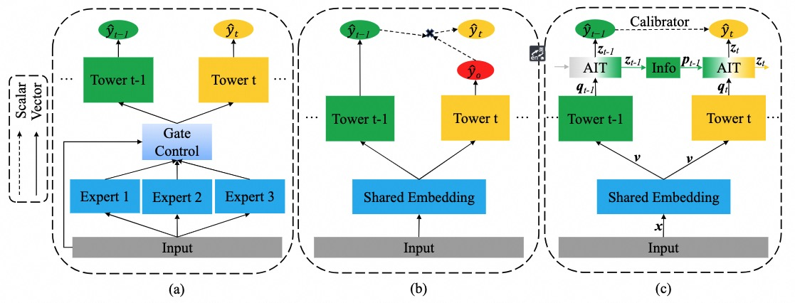

# AITM

### 简介

在推荐场景里，用户的转化链路往往有多个中间步骤（曝光->点击->转化），AITM是一种多任务模型框架，充分利用了链路上各个节点的样本，提升模型对后端节点转化率的预估。



1. (a) Expert-Bottom pattern。如 [MMoE](mmoe.md)
1. (b) Probability-Transfer pattern。如 [ESMM](esmm.md)
1. (c)  Adaptive Information Transfer Multi-task (AITM) framework.

两个特点：

1. 使用Attention机制来融合多个目标对应的特征表征；
1. 引入了行为校正的辅助损失函数。

### 配置说明

```protobuf
model_config {
  model_name: "AITM"
  model_class: "MultiTaskModel"
  feature_groups {
    group_name: "all"
    feature_names: "user_id"
    feature_names: "cms_segid"
    ...
    feature_names: "tag_brand_list"
    wide_deep: DEEP
  }
  backbone {
    blocks {
      name: "share_bottom"
      inputs {
        feature_group_name: "all"
      }
      keras_layer {
        class_name: 'MLP'
        mlp {
          hidden_units: [512, 256]
        }
      }
    }
    blocks {
      name: "ctr_tower"
      inputs {
        block_name: "share_bottom"
      }
      keras_layer {
        class_name: 'MLP'
        mlp {
          hidden_units: 128
        }
      }
    }
    blocks {
      name: "cvr_tower"
      inputs {
        block_name: "share_bottom"
      }
      keras_layer {
        class_name: 'MLP'
        mlp {
          hidden_units: 128
        }
      }
    }
    blocks {
      name: "cvr_aitm"
      inputs {
        block_name: "cvr_tower"
      }
      inputs {
        block_name: "ctr_tower"
      }
      merge_inputs_into_list: true
      keras_layer {
        class_name: "AITMTower"
        aitm {
          transfer_mlp {
            hidden_units: 128
          }
        }
      }
    }
    output_blocks: ["ctr_tower", "cvr_aitm"]
  }
  model_params {
    task_towers {
      tower_name: "ctr"
      label_name: "clk"
      loss_type: CLASSIFICATION
      metrics_set: {
        auc {}
      }
      dnn {
        hidden_units: 64
      }
      weight: 1.0
    }
    task_towers {
      tower_name: "cvr"
      label_name: "buy"
      losses {
        loss_type: CLASSIFICATION
      }
      losses {
        loss_type: ORDER_CALIBRATE_LOSS
      }
      metrics_set: {
        auc {}
      }
      dnn {
        hidden_units: 64
      }
      weight: 1.0
    }
    l2_regularization: 1e-6
  }
  embedding_regularization: 5e-6
}
```

- model_name: 任意自定义字符串，仅有注释作用

- model_class: 'MultiTaskModel', 不需要修改, 通过组件化方式搭建的多目标排序模型都叫这个名字

- feature_groups: 配置一组特征。

- backbone: 通过组件化的方式搭建的主干网络，[参考文档](../component/backbone.md)

  - blocks: 由多个`组件块`组成的一个有向无环图（DAG），框架负责按照DAG的拓扑排序执行个`组件块`关联的代码逻辑，构建TF Graph的一个子图
  - name/inputs: 每个`block`有一个唯一的名字（name），并且有一个或多个输入(inputs)和输出
  - keras_layer: 加载由`class_name`指定的自定义或系统内置的keras layer，执行一段代码逻辑；[参考文档](../component/backbone.md#keraslayer)
  - mlp: MLP模型的参数，详见[参考文档](../component/component.md#id1)
  - cvr_aitm: AITMTower组件，该组件块的input的顺序不能乱写，第一个input必须是当前tower的输入，后续的inputs是依赖的前驱模块
  - output_blocks: backbone的输出tensor列表，顺序必须与下面`model_params`里配置的任务tower一致

- model_params: 多目标建模相关的参数

  - task_towers 根据任务数配置task_towers
    - tower_name
    - dnn deep part的参数配置
      - hidden_units: dnn每一层的channel数目，即神经元的数目
    - 默认为二分类任务，即num_class默认为1，weight默认为1.0，loss_type默认为CLASSIFICATION，metrics_set为auc
    - loss_type: ORDER_CALIBRATE_LOSS 使用目标依赖关系校正预测结果的辅助损失函数，详见原始论文
    - 注：label_fields需与task_towers一一对齐。
  - embedding_regularization: 对embedding部分加regularization，防止overfit

### 示例Config

- [AITM_demo.config](https://github.com/alibaba/EasyRec/blob/master/samples/model_config/aitm_on_taobao.config)

### 参考论文

[AITM: Modeling the Sequential Dependence among Audience Multi-step Conversions with Multi-task Learning in Targeted Display Advertising](https://arxiv.org/pdf/2105.08489.pdf)
